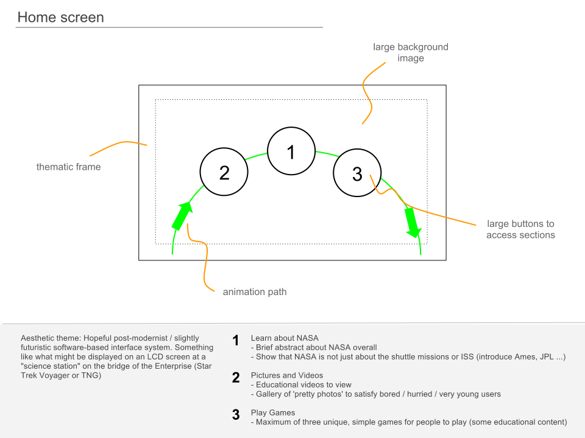
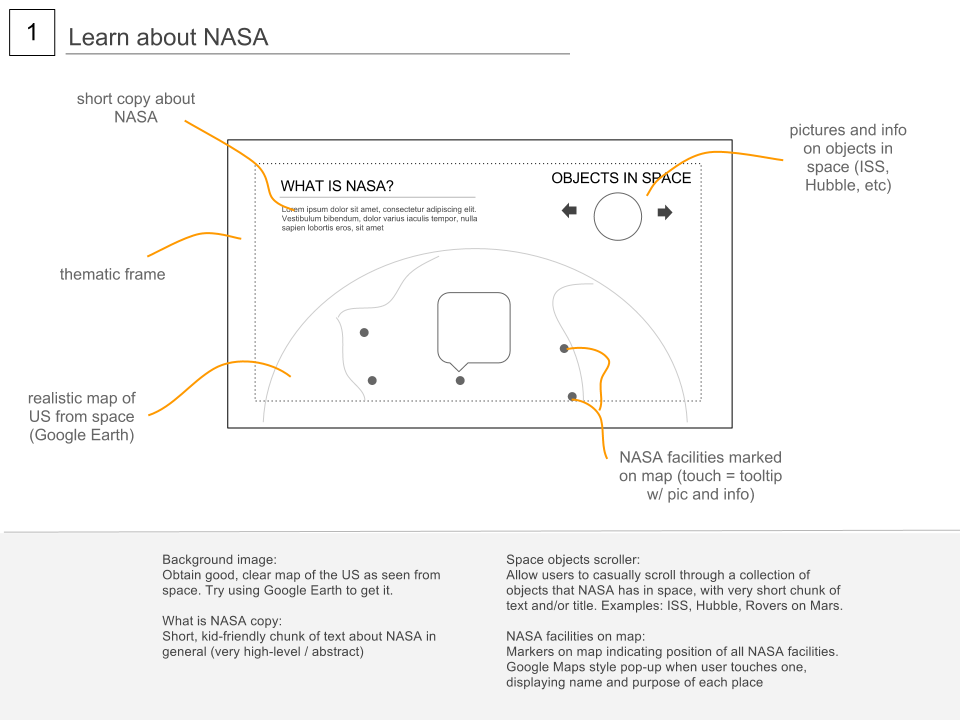
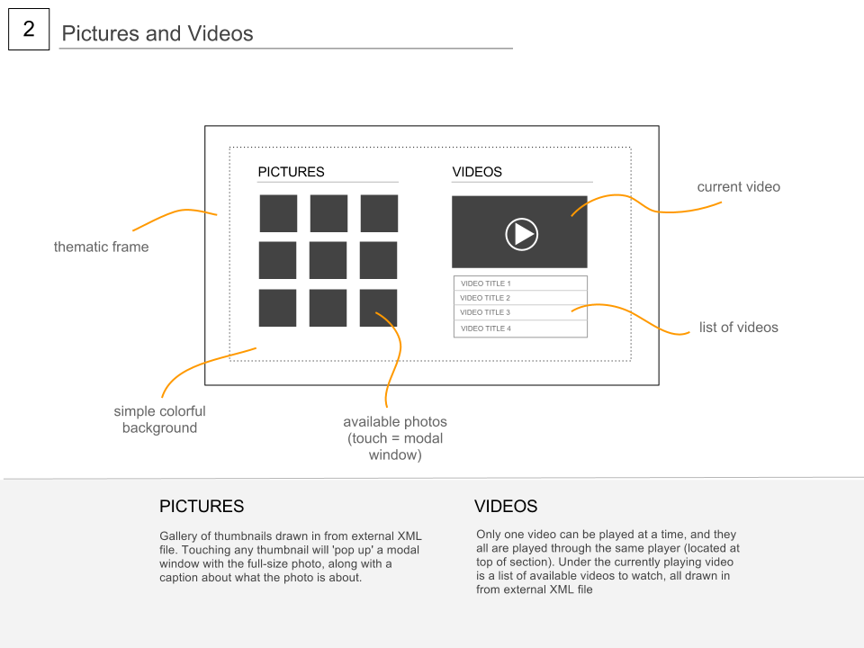
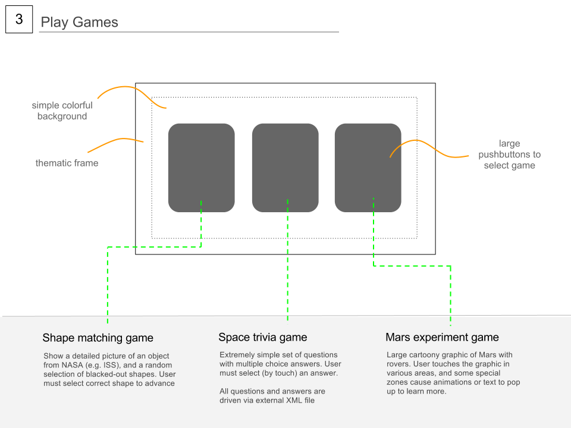

# Space-themed interactive kiosk application

A space-themed interactive kiosk application built in Adobe Flash using ActionScript 3. Intended to be used with a touchscreen display (1920x1080) within a museum or science center.

Click image below to view demo video on YouTube.

## Wireframes

